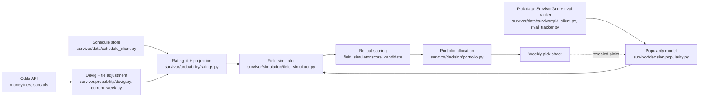

# Survivor

Decision pipeline for the NFL survivor pool. See [plan.md](plan.md) for the
full design (goal, method, phases, technical notes) and its "Progress"
section at the top for phase-by-phase status.

## How it works

Data flows from three free/cheap sources through four layers to a weekly
pick sheet; revealed picks feed back into the popularity model each week
(dashed edge). Module paths are the actual code behind each box.



Everything through the portfolio allocation box (Phases 0-6) is built and
tested; the pick sheet and feedback loop (Phases 7-8) are still open — see
Status below.

## Setup

```bash
python3 -m venv .venv
.venv/bin/pip install -e ".[dev]"
cp .env.example .env   # fill in THE_ODDS_API_KEY (thin free tier: 500 req/month)
```

## Run tests

```bash
.venv/bin/pytest
```

## Weekly recommendation

`run_weekly.py` is the actual production entry point: refreshes real data
(schedule free/ESPN, current-week odds live via The Odds API -- on by
default here, since a real weekly decision is exactly the case worth
spending quota on) and recommends an allocation of your entries across
every team playing that week, via the greedy all-candidate search (Phase
6's validated default -- see plan.md). Saves the pick sheet to
`data_store/pick_sheets/`.

```bash
.venv/bin/python scripts/run_weekly.py --week 4                         # real run, live odds pull
.venv/bin/python scripts/run_weekly.py --week 4 --skip-odds-refresh     # reuse cached odds (or backtest a past week)
.venv/bin/python scripts/run_weekly.py --week 4 --n-paths 5000          # quick/rough look
.venv/bin/python scripts/run_weekly.py --week 4 --n-entries 10 --n-rivals 500
```

Default `--n-paths 20000` runs in a few minutes; raise it (e.g. 80000) for
the final pre-lock decision, but see the script's own docstring for the
runtime-vs-precision tradeoff -- precomputing elimination arrays for every
team playing adds real time beyond Phase 5's own validated budget.

Known simplification: assumes your entries have no picks locked in before
`--week` (true today -- confirm before reusing this for a mid-season week).

## Pull real data without a recommendation

Schedule (ESPN) and pick percentages (SurvivorGrid) are free and keyless.
Odds (The Odds API) is quota-limited and only pulled when asked. Everything
lands under `data_store/` (git-ignored, not committed) as timestamped raw
pulls plus a `latest.csv` per source.

```bash
.venv/bin/python scripts/refresh_all.py                 # schedule + pick percentages
.venv/bin/python scripts/refresh_all.py --odds           # + a live odds pull (uses API quota)
.venv/bin/python scripts/refresh_all.py --pick-week 5
```

Other one-off scripts under `scripts/`: `backfill_rating_history.py` and
`collect_historical_*.py` pull multi-season SurvivorGrid history for
calibration/validation; `backtest_week1.py` replays the pipeline blind
against a past week; the `validate_*.py` scripts check each phase's
acceptance criteria against whatever is cached in `data_store/` (no new API
calls). Run these after `refresh_all.py` — several expect `data_store/`
to already be populated.

## Layout

- `survivor/data/` — ingestion and storage (Phase 1): odds, schedule, and
  SurvivorGrid clients, team-key normalization, rating history, rival
  tracker.
- `survivor/probability/` — devigging, spread-to-probability, team rating
  fit and projection (Phases 2-3).
- `survivor/decision/` — pick popularity model, payout objective, and joint
  portfolio allocation across entries (Phases 4, 6).
- `survivor/simulation/` — field simulator, base-policy assignment, and
  rollout scoring (Phase 5).

## Status

Phases 0 through 6 are done — data ingestion, current- and future-week win
probabilities, the pick popularity model, the Monte Carlo field simulator
with rollout scoring, and joint portfolio allocation across entries, all
wired up and tested (147 tests passing). A blind Week 1, 2026 backtest
(`scripts/backtest_week1.py`) ran the full pipeline end to end successfully.

Two open items: Phase 3's lookahead cross-check (projected spreads within
~1.5 points of real lookahead lines) hadn't passed as of its first commit —
worth rechecking as more lookahead weeks of real data build up. Phase 6's
5-random-seed stability check (`scripts/validate_portfolio.py`, run against
real Week 4, 2026 data) came back a near-tie rather than a clean pass —
entries shuffled between three of five candidate teams across seeds, with
mean payouts within about ±3% of each other at 5,000 paths; worth
re-checking at Phase 5's 80,000-path budget before calling it settled. The
2-percentage-point probability-shift check passed cleanly. That same run
also found that `greedy_local_allocation` searching all ~32 teams playing a
week beats exhaustive search restricted to the top 5 by survival
probability by a real, non-noise margin — see plan.md's Phase 6 section.

Not yet built: Phase 7 (lock-day submission), most of Phase 8 (only the
rival tracker's storage layer exists so far; popularity refinement from the
tracked field, split-decision logic, and the exact endgame solver are still
open), and Phase 9 (a hosted, multi-user/multi-league version — planned in
plan.md, not started). See [plan.md](plan.md)'s "Progress" section for the
full phase-by-phase breakdown.

This checkout has no `.env` or `data_store/` populated (both git-ignored) —
run the Setup and "Pull real data" steps above before running scripts that
touch real data.
